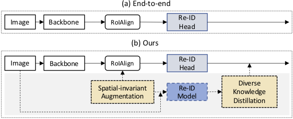
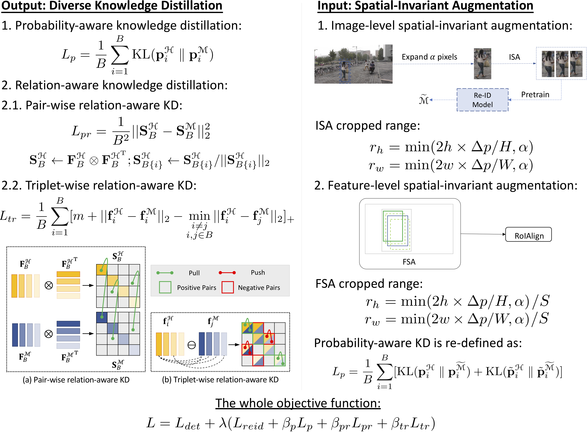

## Diverse Knowledge Distillation for End-to-End Person Search
<strong>Xinyu Zhang</strong>, Xinlong Wang, Jia-Wang Bian, Chunhua Shen and Mingyu You  

#### Abstract
Person search aims to localize and identify a specific person from a gallery of images. Recent methods can be categorized into two groups, i.e., two-step and end-to-end approaches. The former views person search as two independent tasks and achieves dominant results using separately trained person detection and re-identification (Re-ID) models. The latter performs person search in an end-to-end fashion. Although the end-to-end approaches yield higher inference efficiency, they largely lag behind those two-step counterparts in terms of accuracy. In this paper, we argue that the gap between the two kinds of methods is mainly caused by the Re-ID sub-networks of end-to-end methods. To this end, we propose a simple yet strong end-to-end network with diverse knowledge distillation to break the bottleneck. We also design a spatial-invariant augmentation to assist model to be invariant to inaccurate detection results. Experimental results on the CUHK-SYSU and PRW datasets demonstrate the superiority of our method against existing approaches -- it achieves on par accuracy with state-of-the-art two-step methods while maintaining high efficiency due to the single joint model. Code is available at: <a href='https://github.com/zhangxinyu-xyz/DKD-PersonSearch'>[this https URL]. 

#### Framewrok

#### Overview

#### Code
<a href='https://github.com/zhangxinyu-xyz/DKD-PersonSearch'>[Github]</a>

#### Bibtex
 
 

#### Contact
<a href='https://zhangxinyu-xyz.github.io/'>Xinyu Zhang</a>: xyzhang0717@gmail.com  
Minyu You: myyou@tongji.edu.cn  
<a href='https://cshen.github.io/'>Chunhua Shen</a>: Chhshen@gmail.com  

 
 
 
 
<!-- _yay_ -->

#### [Back to homepage](../)
#### [Back to projects](../projects)
