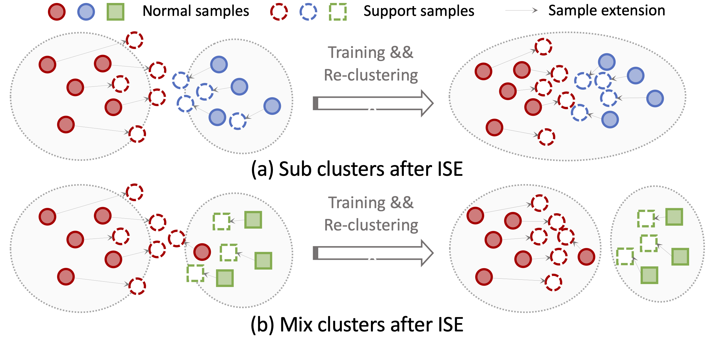
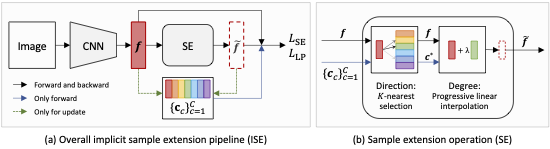
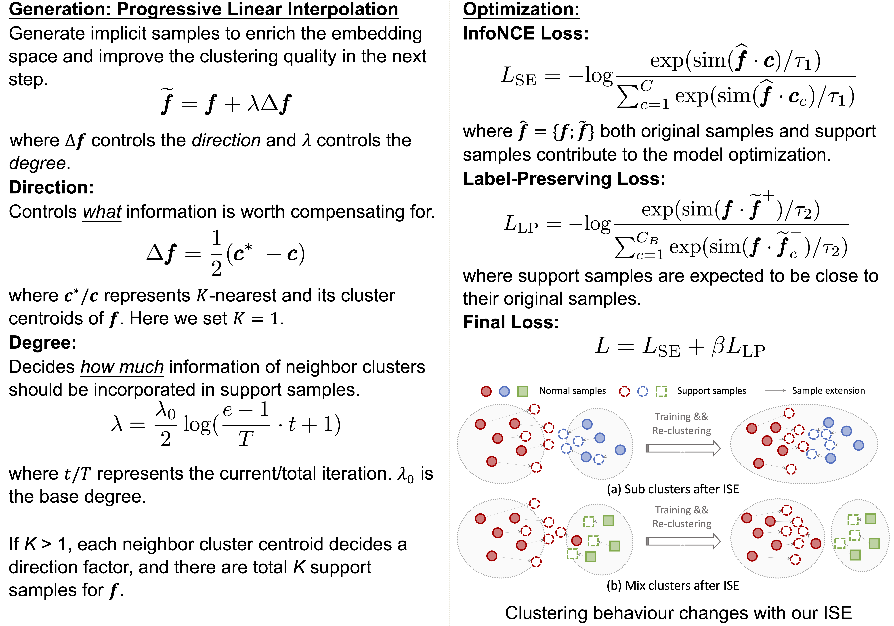

## Implicit Sample Extension for Unsupervised Person Re-Identification
<strong>Xinyu Zhang</strong>*, Dongdong Li*, Zhigang Wang, Jian Wang, Errui Ding, Javen Qinfeng Shi, Zhaoxiang Zhang Jingdong Wang  

#### Abstract
Most existing unsupervised person re-identification (Re-ID) methods use clustering to generate pseudo labels for model training. Unfortunately, clustering sometimes mixes different true identities together or splits the same identity into two or more sub clusters. Training on these noisy clusters substantially hampers the Re-ID accuracy. Due to the limited samples in each identity, we suppose there may lack some underlying information to well reveal the accurate clusters. To discover these information, we propose an Implicit Sample Extension (ISE) method to generate what we call support samples around the cluster boundaries. Specifically, we generate support samples from actual samples and their neighbouring clusters in the embedding space through a progressive linear interpolation (PLI) strategy. PLI controls the generation with two critical factors, i.e., 1) the direction from the actual sample towards its K-nearest clusters and 2) the degree for mixing up the context information from the K-nearest clusters. Meanwhile, given the support samples, ISE further uses a label-preserving loss to pull them towards their corresponding actual samples, so as to compact each cluster. Consequently, ISE reduces the “sub and mixed” clustering errors, thus improving the Re-ID performance. Extensive experiments demonstrate that the proposed method is effective and achieves state-of-the-art performance for unsupervised person Re-ID. Code is available at: <a href='https://github.com/PaddlePaddle/PaddleClas/blob/develop/docs/en/algorithm_introduction/ISE_ReID_en.md'>[https: //github.com/PaddlePaddle/PaddleClas]. 

#### Framewrok

#### Overview

#### Code
<a href='https://github.com/PaddlePaddle/PaddleClas/blob/develop/docs/en/algorithm_introduction/ISE_ReID_en.md'>[Github]</a>

#### Bibtex
 
 

#### Contact
<a href='https://zhangxinyu-xyz.github.io/'>Xinyu Zhang</a>: xyzhang0717@gmail.com  

 
 
 
 
<!-- _yay_ -->

#### [Back to homepage](../)
#### [Back to projects](../projects)
