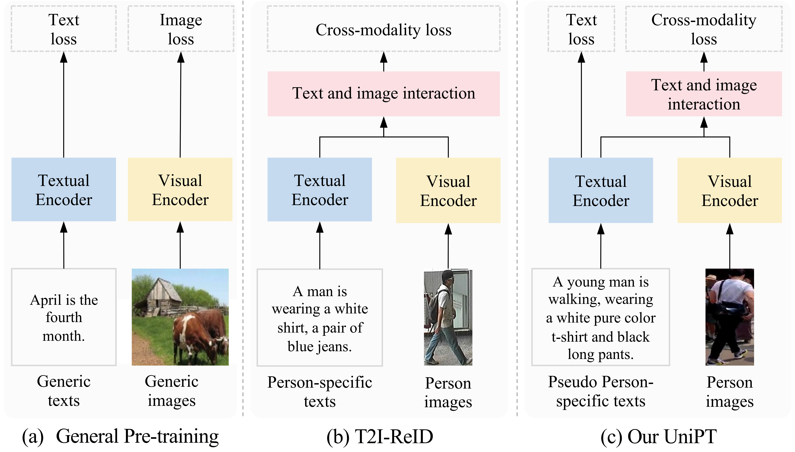
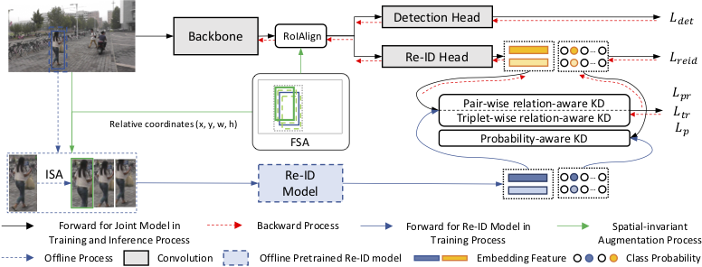
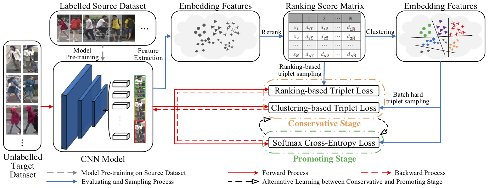
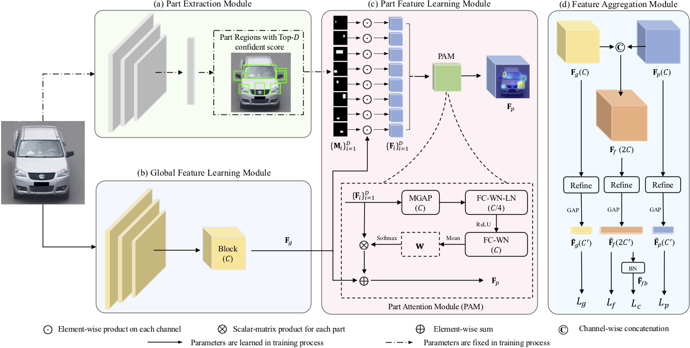
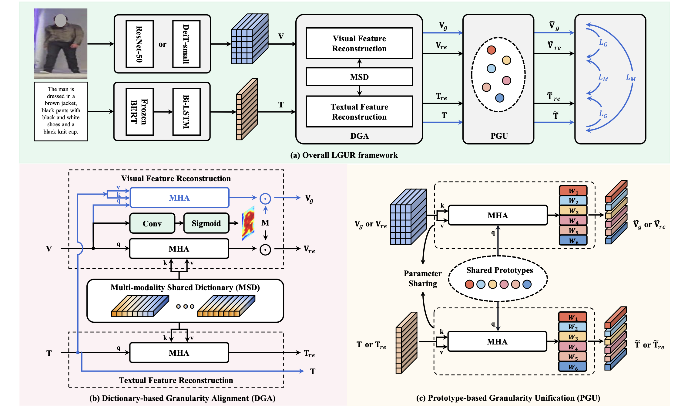

## About Me
I am a research scientist in Baidu VIS, working closely with [Jingdong Wang](https://jingdongwang2017.github.io/). 

Previously, I was a Ph.D student at Tongji University, China and a joint Ph.D student at the University of Adelaide, Australia, supervised by Prof. [Chunhua Shen](https://cshen.github.io/), Prof. [Javen Qinfeng Shi](https://cs.adelaide.edu.au/~javen/), Prof. [Anton van den Hengel](https://cs.adelaide.edu.au/~hengel/) and A/Prof. Mingyu You.
<!-- I am currently a visiting PhD student at the University of Adelaide, Australia, supervised by Prof. [Chunhua Shen](https://cshen.github.io/), Prof. [Javen Qinfeng Shi](https://cs.adelaide.edu.au/~javen/) and Prof. [Anton van den Hengel](https://cs.adelaide.edu.au/~hengel/). -->

<!-- **I am looking for a full time job!** -->
<!-- Before that I got my B.Sc. degree from Tianjin University of Science and Technology. -->

## Research Interests
My research interests focus on Computer Vision and Metric Learning, especially on Re-Identification, Unsupervised Learning and Domain Adaptation.

## News
- 
 [Sep. 2023] One paper is accepted by NeurIPS 2023 for <strong>Human-centric Pretraining</strong>  
- 
 [July. 2023] One paper is accepted by <a href='https://iccv2023.thecvf.com/'>[ICCV 2023]</a> for Image-Text <strong>Pretraining</strong> for Person Re-ID  
- 
 [Apr. 2023] One paper is accepted by TIP for Unsupervised Person Re-ID  
- 
 [Jul. 2022] One paper is accepted by <a href='https://eccv2022.ecva.net/'>[ECCV 2022]</a> for Foundation Model (UFO)  
- 
 [Jun. 2022] One paper is accepted by <a href='https://2022.acmmm.org/'>[ACMMM 2022]</a> for Text-to-Image Person Re-ID  
- 
 [Apr. 2022] One paper is accepted by <a href='https://ijcai-22.org/'>[IJCAI 2022]</a> for Unsupervised Person Re-ID  
- 
 [Feb. 2022] One paper is accepted by <a href='https://cvpr2022.thecvf.com/'>[CVPR 2022]</a> for Unsupervised Person Re-ID. <strong>The code of pytorch version is released.</strong>  
- 
 [Sep. 2021] Defended my Ph.D. thesis successfully! 
- 
 [Dec. 2020] One paper is accepted by <a href='https://aaai.org/Conferences/AAAI-21/'>[AAAI 2021]</a> for Person Search  
- 
 [Oct. 2020] One paper is accepted by TITS 2020 for Vechicle Re-ID  
- 
 [Jul. 2019] One paper is accepted by <a href='https://iccv2019.thecvf.com/'>[ICCV 2019] for UDA Person Re-ID  
<!-- - 
 [project] <a href='projects'>[project]   -->

## Publications  
* Equal contribution + Project lead ** Corresponding author

- 
 <strong>HAP: Structure-Aware Masked Image Modeling for Human-Centric Perception</strong> 
Junkun Yuan*, <strong>Xinyu Zhang</strong>*+, Hao Zhou, Jian Wang, Zhongwei Qiu, Zhiyin Shao, Shaofeng Zhang, Sifan Long, Kun Kuang, Kun Yao, Junyu Han, Errui Ding, Lanfen Lin, Fei Wu and Jingdong Wang**  
NeurIPS, 2023

- 
 <strong>Unified Pre-training with Pseudo Texts for Text-To-Image Person Re-identification</strong> 
Zhiyin Shao*, <strong>Xinyu Zhang</strong>*, Changxing Ding, Jian Wang and Jingdong Wang  
ICCV, 2023
<a href='https://arxiv.org/abs/2309.01420.pdf'>[PDF]</a>
<a href='https://github.com/ZhiyinShao-H/UniPT'>[Code]</a>

<!-- <a href='DKD-Person-Search'>[Project]</a>
 -->

- 
 <strong>Implicit Sample Extension for Unsupervised Person Re-Identification</strong> 
<strong>Xinyu Zhang</strong>, Dongdong Li, Zhigang Wang, Jian Wang, Javen Qinfeng Shi, Zhaoxiang Zhang and Jingdong Wang  
CVPR, 2022
<a href='https://arxiv.org/abs/2204.06892v1'>[PDF]</a>
<a href='https://github.com/PaddlePaddle/PaddleClas/blob/develop/docs/en/algorithm_introduction/ISE_ReID_en.md'>[Paddle Code]</a>
<a href='https://github.com/zhangxinyu-xyz/ISE-ReID'>[Pytorch Code]</a>

<!-- <a href='DKD-Person-Search'>[Project]</a>
 -->

  
- 
 <strong>Diverse Knowledge Distillation for End-to-End Person Search</strong> 
<strong>Xinyu Zhang</strong>, Xinlong Wang, Jia-Wang Bian, Chunhua Shen and Mingyu You  
AAAI, 2021
<a href='https://arxiv.org/abs/2012.11187'>[PDF]</a>
<a href='https://github.com/zhangxinyu-xyz/DKD-PersonSearch'>[Code]</a>
<a href='DKD-Person-Search'>[Project]</a>

- 
 <strong>Self-Training with Progressive Augmentation for Unsupervised Cross-Domain Person Re-identification</strong> 
<strong>Xinyu Zhang</strong>, Jiewei Cao, Chunhua Shen and Mingyu You  
ICCV, 2019
<a href='https://openaccess.thecvf.com/content_ICCV_2019/papers/Zhang_Self-Training_With_Progressive_Augmentation_for_Unsupervised_Cross-Domain_Person_Re-Identification_ICCV_2019_paper.pdf'>[PDF]</a>
<a href='https://github.com/zhangxinyu-xyz/PAST-ReID'>[Code]</a>

- 
 <strong>Part-Guided Attention Learning for Vehicle Instance Retrieval</strong> 
<strong>Xinyu Zhang</strong>, Rufeng Zhang, Jiewei Cao, Dong Gong, Mingyu You and Chunhua Shen  
IEEE Transactions on Intelligent Transportation Systems (TITS), 2020
<a href='https://arxiv.org/abs/1909.06023v3'>[PDF]</a>

- 
 <strong>Learning Granularity-Unified Representations for Text-to-Image Person Re-identification</strong> 
Zhiyin Shao, <strong>Xinyu Zhang</strong>, Meng Fang, Zhifeng Lin, Jian Wang, and Changxing Ding  
ACMMM, 2022
<a href='https://arxiv.org/abs/2207.07802'>[PDF]</a>
<a href='https://github.com/ZhiyinShao-H/LGUR'>[Code]</a>

<!-- <a href='DKD-Person-Search'>[Project]</a>
 -->

- 
 <strong>Self-Guided Hard Negative Generation for Unsupervised Person Re-Identification</strong> 
Dongdong Li, Zhigang Wang, Jian Wang, Xinyu Zhang, Errui Ding, Jingdong Wang, Zhaoxiang Zhang  
IJCAI, 2022
<a href='https://www.ijcai.org/proceedings/2022/0149.pdf'>[PDF]</a>
<!-- <a href='https://github.com/ZhiyinShao-H/LGUR'>[Code]</a>
 -->
<!-- <a href='DKD-Person-Search'>[Project]</a>
 -->
<!--  -->
  
- 
 <strong>UFO: Unified Feature Optimization</strong> 
Teng Xi, Yifan Sun, Deli Yu, Bi Li, Nan Peng, Gang Zhang, <strong>Xinyu Zhang</strong>, Zhigang Wang, Jinwen Chen, Jian Wang, Lufei Liu, Haocheng Feng, Junyu Han, Jingtuo Liu, Errui Ding, Jingdong Wang  
ECCV, 2022
<a href='https://arxiv.org/abs/2207.10341'>[PDF]</a>
<!-- <a href='https://github.com/ZhiyinShao-H/LGUR'>[Code]</a>
 -->
<!-- <a href='DKD-Person-Search'>[Project]</a>
 -->
<!--  -->
  
- 
 <strong>A Real-time Memory Updating Strategy for Unsupervised Person Re-identification</strong> 
Junhui Yin, <strong>Xinyu Zhang</strong>, Zhanyu Ma, Jun Guo, Yifan Liu  
TIP, 2023
<a href='https://ieeexplore.ieee.org/abstract/document/10102757'>[PDF]</a>
  
- 
 <strong>Memorizing Comprehensively to Learn Adaptively: Unsupervised Cross-Domain Person Re-ID with Multi-level Memory</strong> 
<strong>Xinyu Zhang</strong>, Dong Gong, Jiewei Cao and Chunhua Shen  
Arxiv preprint, 2020
<a href='https://arxiv.org/abs/2001.04123'>[PDF]</a>

    
- 
 <strong>An extended filtered channel framework for pedestrian detection</strong> 
Mingyu You, Yubin Zhang, Chunhua Shen and <strong>Xinyu Zhang</strong>  
IEEE Transactions on Intelligent Transportation Systems (TITS), 2018
<a href='https://ieeexplore.ieee.org/abstract/document/8310009'>[PDF]</a>
<!--  -->
  
- 
 <strong>Improved Face Verification with Simple Weighted Feature Combination</strong> 
<strong>Xinyu Zhang</strong>, Jiang Zhu and Mingyu You  
CCF Chinese Conference on Computer Vision (CCCV), 2017
<a href='https://link.springer.com/chapter/10.1007/978-981-10-7302-1_2'>[PDF]</a>

## Professional Activities
- 
 <strong>Conference Reviewer</strong> 
CVPR, ICCV, ECCV, AAAI, IJCAI
- 
 <strong>Journal Reviewer</strong> 
IJCV, PR, Neurocomputing

