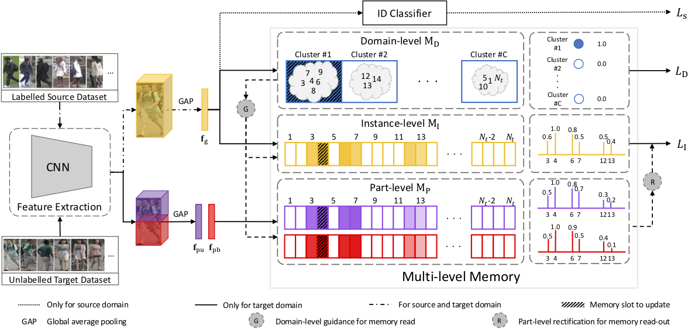

## About Me
I am a research scientist in Baidu VIS, working closely with [Jingdong Wang](https://jingdongwang2017.github.io/), Jian Wang, Zhigang Wang and [Errui Ding](https://scholar.google.com/citations?user=1wzEtxcAAAAJ&hl=zh-CN). 

Previously, I was a Ph.D student at Tongji University, China and a joint Ph.D student at the University of Adelaide, Australia, supervised by Prof. [Chunhua Shen](https://cshen.github.io/), Prof. [Javen Qinfeng Shi](https://cs.adelaide.edu.au/~javen/), Prof. [Anton van den Hengel](https://cs.adelaide.edu.au/~hengel/) and A/Prof. Mingyu You.
<!-- I am currently a visiting PhD student at the University of Adelaide, Australia, supervised by Prof. [Chunhua Shen](https://cshen.github.io/), Prof. [Javen Qinfeng Shi](https://cs.adelaide.edu.au/~javen/) and Prof. [Anton van den Hengel](https://cs.adelaide.edu.au/~hengel/). -->

<!-- **I am looking for a full time job!** -->
<!-- Before that I got my B.Sc. degree from Tianjin University of Science and Technology. -->

## Research Interests
My research interests focus on Computer Vision and Metric Learning, especially on Re-Identification, Unsupervised Learning and Domain Adaptation.

## News
- 
 [Feb. 2022] One paper is accepted by CVPR2022 for Unsupervised Person Re-ID  
- 
 [Dec. 2020] One paper is accepted by <a href='https://aaai.org/Conferences/AAAI-21/'>[AAAI 2021]</a>  
- 
 [Oct. 2020] One paper is accepted by TITS 2020  
- 
 [Jul. 2019] One paper is accepted by <a href='https://iccv2019.thecvf.com/'>[ICCV 2019]  
<!-- - 
 [project] <a href='projects'>[project]   -->

## Publications
- 
 <strong>Diverse Knowledge Distillation for End-to-End Person Search</strong> 
<strong>Xinyu Zhang</strong>, Xinlong Wang, Jia-Wang Bian, Chunhua Shen and Mingyu You  
AAAI, 2021
<a href='https://arxiv.org/abs/2012.11187'>[PDF]</a>
<a href='https://github.com/zhangxinyu-xyz/DKD-PersonSearch'>[Code]</a>
<a href='DKD-Person-Search'>[Project]</a>

- 
 <strong>Self-Training with Progressive Augmentation for Unsupervised Cross-Domain Person Re-identification</strong> 
<strong>Xinyu Zhang</strong>, Jiewei Cao, Chunhua Shen and Mingyu You  
ICCV, 2019
<a href='https://openaccess.thecvf.com/content_ICCV_2019/papers/Zhang_Self-Training_With_Progressive_Augmentation_for_Unsupervised_Cross-Domain_Person_Re-Identification_ICCV_2019_paper.pdf'>[PDF]</a>
<a href='https://github.com/zhangxinyu-xyz/PAST-ReID'>[Code]</a>

- 
 <strong>Part-Guided Attention Learning for Vehicle Instance Retrieval</strong> 
<strong>Xinyu Zhang</strong>, Rufeng Zhang, Jiewei Cao, Dong Gong, Mingyu You and Chunhua Shen  
IEEE Transactions on Intelligent Transportation Systems (TITS), 2020
<a href='https://arxiv.org/abs/1909.06023v3'>[PDF]</a>

  
- 
 <strong>Memorizing Comprehensively to Learn Adaptively: Unsupervised Cross-Domain Person Re-ID with Multi-level Memory</strong> 
<strong>Xinyu Zhang</strong>, Dong Gong, Jiewei Cao and Chunhua Shen  
Arxiv preprint, 2020
<a href='https://arxiv.org/abs/2001.04123'>[PDF]</a>

    
- 
 <strong>An extended filtered channel framework for pedestrian detection</strong> 
Mingyu You, Yubin Zhang, Chunhua Shen and <strong>Xinyu Zhang</strong>  
IEEE Transactions on Intelligent Transportation Systems (TITS), 2018
<a href='https://ieeexplore.ieee.org/abstract/document/8310009'>[PDF]</a>
<!--  -->
  
- 
 <strong>Improved Face Verification with Simple Weighted Feature Combination</strong> 
<strong>Xinyu Zhang</strong>, Jiang Zhu and Mingyu You  
CCF Chinese Conference on Computer Vision (CCCV), 2017
<a href='https://link.springer.com/chapter/10.1007/978-981-10-7302-1_2'>[PDF]</a>

## Professional Activities
- 
 <strong>Conference Reviewer</strong> 
ICCV2021, IJCAI2021 (SPC), CVPR2021, AAAI2021, PRCV2020
- 
 <strong>Journal Reviewer</strong> 
PR

